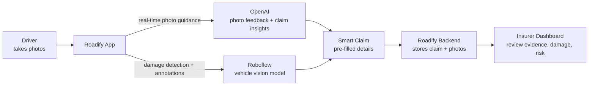

# Roadify — APIs & Integrations

## Pitch Deck Tech Stack Diagram — Slide Overview

**Slide summary:** Roadify guides the driver while they take photos, uses AI to extract claim details, sends damage photos through Roboflow for annotated visual evidence, then stores everything for the insurer dashboard.

---

## Detailed Tech Stack Diagram

```mermaid
flowchart LR
    Driver["Driver<br/>captures incident photos"] --> App["React PWA<br/>Driver App"]

    App -->|GPS location| Weather["Open-Meteo API<br/>current weather"]
    App -->|each new photo<br/>fast coverage check| Coach["OpenAI GPT-4o-mini<br/>Photo Coverage Coach"]
    Coach -->|suggests missing angles<br/>plate, wide scene, close-up| App

    App -->|up to 6 resized photos<br/>parallel processing| Roboflow["Roboflow Workflows<br/>vehicle damage vision model"]
    App -->|same photos + claim context<br/>parallel processing| VisionAI["OpenAI GPT-4o-mini<br/>plate + vehicle + incident analysis"]

    Roboflow -->|damage classes<br/>bounding boxes<br/>annotated images| Review["Review Claim<br/>driver confirms details"]
    VisionAI -->|rego, make, model,<br/>incident type, description| Review
    Weather -->|temperature, wind,<br/>weather code| Review

    Review -->|claim payload<br/>original + annotated photos<br/>detections + AI fields| Backend["Node.js + Express API<br/>Azure App Service"]

    Backend -->|store original and<br/>annotated images| Blob["Azure Blob Storage<br/>claim photos"]
    Backend -->|store claim JSON,<br/>photo metadata,<br/>ML detections, weather| Cosmos["Azure Cosmos DB<br/>Incidents container"]

    Backend -.->|async after submission<br/>claim data + detections<br/>weather + signed photo URLs| ReportAI["OpenAI GPT-5.4<br/>AI incident report<br/>severity + liability + fraud"]
    Blob -.->|signed read URLs<br/>for original photos| ReportAI
    ReportAI -.->|structured JSON report| Cosmos

    Dashboard["Claims Dashboard<br/>assessor view"] -->|read claim + report| Cosmos
    Dashboard -->|view originals + annotations<br/>via SAS URLs| Blob
```

**Pitch summary:** OpenAI is used twice on the driver side: first for real-time photo coaching while photos are being taken, then for fast incident/plate analysis during processing. Roboflow handles the specialised computer vision step for damage detection and returns annotated images. When the claim is submitted, originals and annotations are stored in Azure Blob Storage, claim data is stored in Cosmos DB, and a backend async OpenAI report writes the final claims assessment back to the database for the dashboard.

---

## 1. Roboflow (Damage Detection)

**What it does:** Automated ML-based vehicle damage detection and annotation.

**Endpoint:** Roboflow Workflows API (serverless)

**How we use it:**
- Each uploaded photo is resized to 1024px max and sent as base64 to the Roboflow workflow.
- The workflow runs a custom-trained object detection model that identifies damage types: dents, scratches, broken lights, bumper damage, bonnet damage, windshield damage, etc.
- Returns bounding-box predictions (class + confidence) and an annotated image with damage regions highlighted.
- All photos are processed **in parallel** for speed.

**Output:** Damage class labels, confidence scores, and annotated images overlaid on originals.

---

## 2. OpenAI GPT (Photo Coaching + Photo Analysis + Incident Report)

We use **three OpenAI call paths** — two client-side flows for the driver experience, plus one backend async report for the assessor dashboard.

### 2a. Photo Analysis (Client-Side) — `gpt-4o-mini`

**What it does:** Reads number plates, identifies vehicles, and classifies the incident.

**How we use it:**
- Sends up to 6 photos with a prompt describing the claimant's vehicle.
- GPT reads licence plates, identifies the other vehicle's make/model/color, and classifies the incident type (collision, rollover, hit-and-run, etc.).
- Generates a brief factual description of the incident.
- Runs **in parallel** with Roboflow so there's no added wait time.

**Output:** Other vehicle details (rego, make, model, color), incident type, description.

### 2b. AI Incident Report (Backend, Async) — `gpt-5.4`

**What it does:** Generates a comprehensive claims assessment with fraud analysis.

**How we use it:**
- Triggered **asynchronously** on the backend after the claim is submitted — the user doesn't wait for it.
- Receives: claim data, ML damage detections, weather data, incident context, and up to 3 original photos (via signed Azure Blob URLs).
- Produces a structured JSON report containing:
  - Severity narrative and repair class estimate
  - Liability assessment
  - Scene assessment (inferred road surface, speed, vehicle positions)
  - Weather cross-check (compares API weather vs. what's visible in photos)
  - Fraud analysis with risk score (1-10) and specific indicators
  - Photo references with inline mentions for the dashboard

**Output:** Full JSON report stored in CosmosDB alongside the claim.

### 2c. Photo Coverage Coach (Client-Side) — `gpt-4o-mini`

**What it does:** Real-time guidance while the user takes photos.

**How we use it:**
- As the user adds photos, it evaluates coverage and suggests what's missing (e.g. "Take a wide scene shot" or "Get the other vehicle's plate").
- Uses `detail: 'low'` for fast responses.

---

## 3. Open-Meteo (Weather)

**What it does:** Provides real-time weather data at the incident location.

**Endpoint:** `https://api.open-meteo.com/v1/forecast`

**How we use it:**
- When the app gets the user's GPS location, it fetches current weather conditions (temperature, wind speed, weather code).
- This data is included in the claim payload and passed to the AI report.
- The dashboard displays a visual cross-check: "Local weather at time" vs. "Visible in photos" — if there's a mismatch (e.g. API says clear but photos show snow), it's flagged.

**Why:** Free, no API key required, provides an independent data point for fraud detection.

---

## 4. CARTO / Leaflet (Maps)

**What it does:** Interactive maps showing incident location.

**How we use it:**
- **Driver app:** Shows the user's current location on the welcome page using CARTO dark tiles via Leaflet.
- **Dashboard:** Displays the incident location with a marker and a "Google Maps" button for the claims assessor.

---

## 5. Azure Cosmos DB (Database)

**What it does:** Stores all claim data as JSON documents.

**How we use it:**
- Each claim is a single document with all fields: driver info, vehicle details, incident context, photos metadata, ML detections, AI report, severity, weather.
- Partitioned by claim `id` for fast lookups.
- The AI report is written back to the same document asynchronously after generation.

---

## 6. Azure Blob Storage (Photos)

**What it does:** Stores original and annotated claim photos.

**How we use it:**
- Photos are uploaded as base64 in the claim payload, then the backend uploads them to Blob Storage.
- Stored under `claims/{claimId}/{slot}-{type}.jpg`.
- Dashboard access uses time-limited read-only SAS tokens generated server-side (no public blob access).
